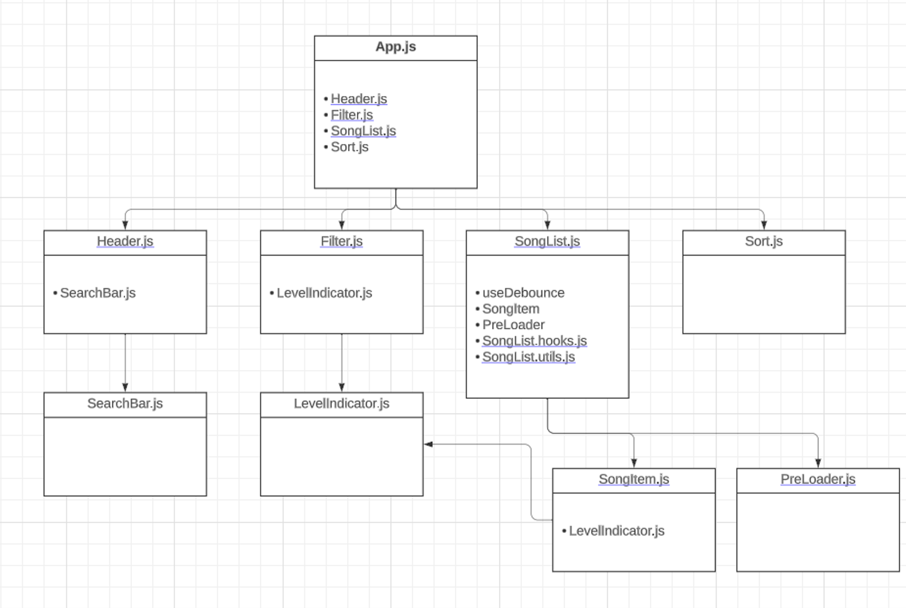

# Welcome!

Welcome to the song-directory project!

The purpose of this project is using some of the most useful tools and techniques in React in a general web project. Tools and techniques like states, hooks, virtualization, using APIs, optmizied architecture of the project, debounce, search, filter, testing and etc. 

In this single page application, I will fetch a huge song list from an API and will list them by using React-Window. Also, I will filter those songs based on levels and also sort them in ascending or descending format based on their levels. Finally, there is a search bar available to search for songs based on title, artist or album. Last but not least, the whole application is designed fully responsive. So, feel free to use it by your phone, too.  
# Table of Contents

1. [Tools and Techniques](#tools-and-techniques)
2. [How to launch the project](#how-to-launch-the-project)
3. [Overview of the project](#overview-of-the-project)
4. [Structure Information](#structure-information)
5. [Future Work](#future-work)

# Tools and Techniques

- States
- Hooks
- useEffect
- Async Functions
- Debounce
- API calls
- Filter
- Sort
- Virtualization
- Automated testing
- Search
- Optimized Components Architecture
- useMemo
- Responsive Design

# How to launch the project
First, in the project directory, run:

### `npm install`

In the project directory, you can run:

### `npm start`

Runs the app in the development mode.\
Open [http://localhost:3000](http://localhost:3000) to view it in your browser.

The page will reload when you make changes.\
You may also see any lint errors in the console.

### `npm test`

Launches the test runner in the interactive watch mode.\
See the section about [running tests](https://facebook.github.io/create-react-app/docs/running-tests) for more information.

### `npm run build`

Builds the app for production to the `build` folder.\
It correctly bundles React in production mode and optimizes the build for the best performance.

The build is minified and the filenames include the hashes.\
Your app is ready to be deployed!

See the section about [deployment](https://facebook.github.io/create-react-app/docs/deployment) for more information.

### `npm run eject`

**Note: this is a one-way operation. Once you `eject`, you can't go back!**

If you aren't satisfied with the build tool and configuration choices, you can `eject` at any time. This command will remove the single build dependency from your project.

Instead, it will copy all the configuration files and the transitive dependencies (webpack, Babel, ESLint, etc) right into your project so you have full control over them. All of the commands except `eject` will still work, but they will point to the copied scripts so you can tweak them. At this point you're on your own.

You don't have to ever use `eject`. The curated feature set is suitable for small and middle deployments, and you shouldn't feel obligated to use this feature. However we understand that this tool wouldn't be useful if you couldn't customize it when you are ready for it.

# Overview of the project
In the following, you can see a screenshot of the web application with default settings.

Here, you can see that some of the levels in the filter section are selected and the songs are filtered based on them.

In this image, I'm using sort to sort the songs based on their levels.

Here you can see how the search is working.

Finally, in this picture, you can see the appearance of the application in smaller screens to check the responsiveness.

 
# Structure Information

# Future Work
There are still some other things that can be done in this project to make it better/optimized. In order to make the project ready in the provided time, I decided to list all these next steps here and prevent implementing them. Here I'm going to give some possible future works for this project:

1. Adding more detailed tests that cover various aspects of each component.
2. Adding a modal error box to show errors while fetching data (instead of console.error).
3. Disable level indicators in the filter box while all the filtered data is being loaded.
4. Solve the problem with test configuration.